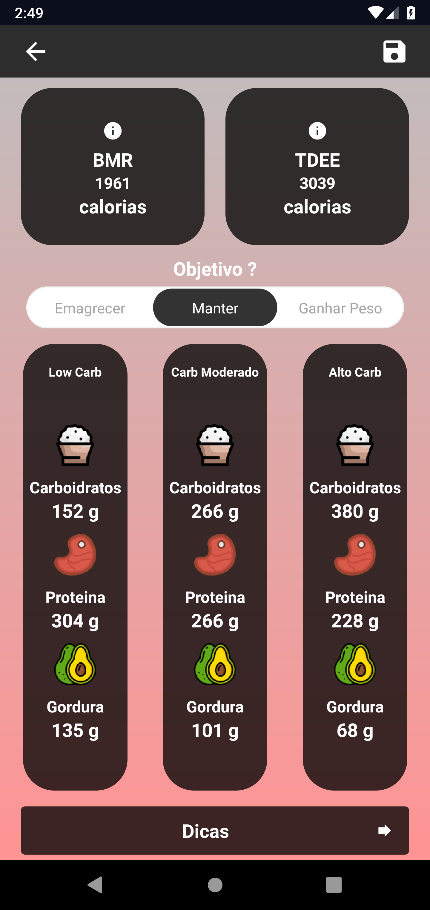
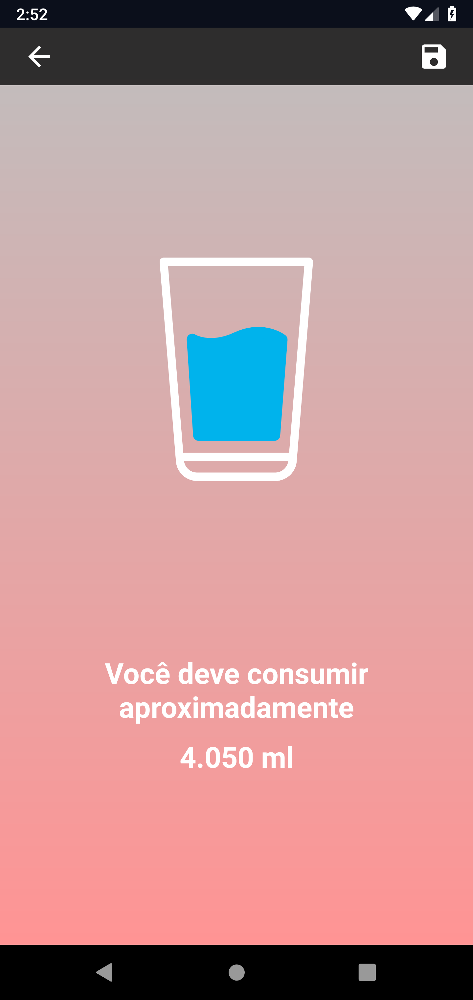

<h1 align="center">
  
</h1>

<h2 align="center">
  App Fitness Calculator
</h2>

  

## :iphone: Sobre o APP

Aplicação criada utilizando React Native, com propósito de calcular taxa metabólica basal, gasto energético diário, calculo ingestão hidrica e calculo dos macros nutrientes para uma dieta baseado no seu [TDEE](http://www.inovenutrition.com.br/gasto-calorico-processo-de-emagrecimento/)

### Funcionalidades

- Cálculo TDEE
- Cálculo BMR
- Cálculo ingestão hidrica
- Cálculo macro nutrientes p/ dieta
- Mensagens motivacionais
- Histórico

## :framed_picture: Screen App

<h1 align="center">

  
  
  
</h1>

## 📝 Licença

Esse projeto está sob a licença MIT

---

Criado por Matheus - [Linkedin](https://www.linkedin.com/in/mfzaguiar/)
